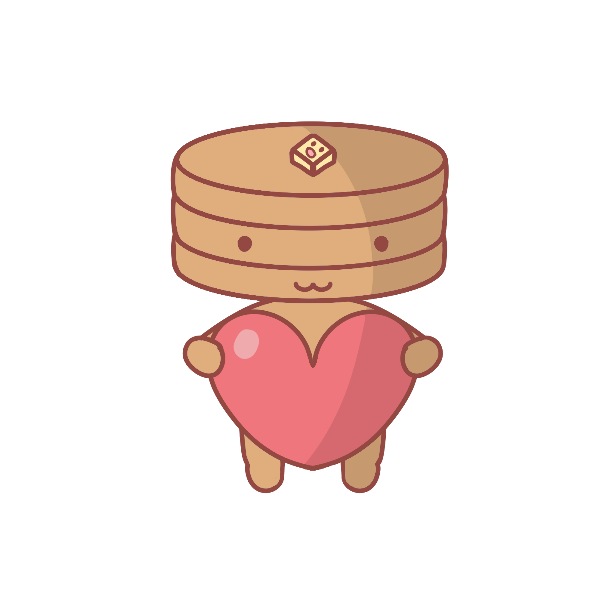

<h1 align="center">Hi 👋, I'm Pancake</h1>
<h3 align="center">Just some random person</h3>

<h2>About me</h2>

  Coding is one of my favorite hobbies. I always enjoy learning more and challenging myself to expand what I know.

  I'm currently working on a BA in Computer Science at WPI. Outside of that, I like writing random bits of code for automation or small projects to show others. Recently I've been switching mainly to Linux and having fun making my own configs.

<h2>Tech & Tools</h2>

  
  
  
  
  
  
  
  
  
  

  

